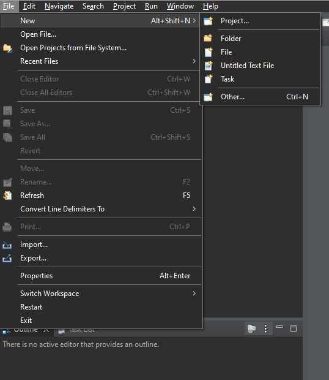
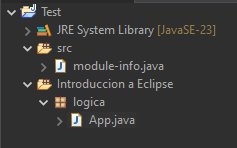

# 📚 Ayudantías POO


Holaa, este es un repositorio donde se almacenan tanto pruebas, ayudantías y talleres. Adicionalmente se incorporara una guía de estudio para que puedan resolver sus dudas y complementar con lo visto en clases. Hecho por estudiantes para estudiantes ┗|｀O′|┛.

---

## ⚡ Índice de Contenidos

Haz clic en los enlaces para ir directamente a la explicación del tema:

0.  [Introducción a Eclipse](#0-introducción-a-eclipse)
1.  [Introducción a Java](#1-introducción-a-java)
2.  [Entrada y Salida de Datos](#2-scanner-y-file) (Scanner & File)
3.  [Manejo de Excepciones](#3-try-catch)
4.  [Arreglos Estáticos](#4-vectores) (Vectores)
5.  [Conceptos Fundamentales POO](#5-objetos-y-referencias) (Objetos y Referencias)
6.  [Colecciones Dinámicas](#6-arraylist)
7.  [Herencia](#7-herencia)
8.  [Interfaces](#8-interfaces)
9.  [Arquitectura de Software](#9-arquitectura)
10. [Patrones de Diseño](#10-patrones-de-diseño)
    * [Singleton](#singleton)
    * [Factory](#factory)
    * [Strategy](#strategy)
    * [Visitor](#visitor)
11. [Interfaz Gráfica (Swing)](#11-gui-java-swing)

---

## 0. Introducción a Eclipse

Lo primero es instalar el idle que nos acompañara durante el curso, deben ir a la pagina principal de Eclipse donde encontraran el link de descarga.
<ul>
    <li><a href="https://www.eclipse.org/downloads/packages/">Click para ir a la pagina!</a></li>
</ul>

Luego deben seleccionar la opcion <b>x86_64</b> del sistema operativo correspondiente al suyo.

---

Ahora procederemos a hacer nuestro primer proyecto en Java, seleccionando la opción "File" que se encuentra en la parte superior izquierda.



Luego pasaremos a seleccionar las siguientes opciones en el siguiente orden:
<ol>
    <li>New</li>
    <li>Project</li>
    <li>Java</li>
    <li>Java Project</li>
</ol>

Ingresamos el nombre que le queramos entregar al proyecto y seleccionamos "Next". Ahora mismo ya tenemos nuestro primer proyecto creado, antes de crear nuestra primera clase para comenzar a escribir codigo, veremos un poco como podemos organizar el proyecto para mantener siempre un buen orden al momento de programar.

Por defecto siempre viene una carpeta de packages default que podemos identificar como "src", donde podremos crear nuestros packages ahí mismo o hacer uno nuevo, en este caso haremos uno nuevo. Ahora seleccionaremos la raiz de nuestro proyecto y le haremos click derecho, luego seleccionaremos <b>"new"</b> y <b>"Source Folder"</b>, le damos el nombre y a <b>"Finish"</b>.

Luego la seleccionaremos y haremos el mismo prodecimiento pero esta vez crearemos un nuevo <b>"Package"</b>.

Ahora una ultima vez pero esta vez crearemos una <b>"Class"</b>.

Finalmente si siguieron los pasos bien habran finalizado y les debería quedar algo así:




## 1. Introducción a Java

Finalmente comenzaremos a codear!

Dentro de la clase App.java, tendremos algo así.
```java
package logica;

public class App {

}
```

Ahora debemos hacer nuestro metodo 'main' el cual sera donde comenzara a correr nuestro programa. este se define como "public static void main(String[] args) {} ".

Dentro de este mismo ya podemos comenzar a codear la logica de nuestro programa, como por ejemplo imprimir nuestro primer "Hola mundo!", donde el "print" de python se define como
"System.out.println("Hola mundo!");".

```java
package logica;

public class App {
    public static void main(String[] args) {
        System.out.println("Hola mundo!");
    }
}
```

Tambien podemos declarar e imprimir variables, por ejemplo podemos hacer una variable de tipo "String" (texto) e imprimirla.

```java
package logica;

public class App {
    public static void main(String[] args) {
        String texto = "Hola Mundo!";
        System.out.println(texto);
    }
}
```

Tenemos seis principales tipos de variables:
<ul>
    <li>String (texto)</li>
    <li>char (caracter unico ejemplo: 'a')</li>
    <li>int (número entero)</li>
    <li>float (decimal de 32 bits)</li>    
    <li>double (decimal de 64 bits)</li>
    <li>boolean (Verdadero o Falso)</li>
</ul>

Donde tambien tenemos diferentes formas de imprimir por consola, las principales son:

<ul>
    <li>System.out.println() --> imprime y salta a la siguiente linea en consola</li>
    <li>System.out.print() --> imprime pero no hace el salto de linea</li>
    <li>System.out.printf() --> nos permite imprimir sin tener que concadenar de forma manual (usar el +) al utilizar texto y variables</li>
</ul>

### Ejemplo LN()

```java
package logica;

public class App {
    public static void main(String[] args) {
        String texto = "Hola Mundo!";
        System.out.println(texto);
        System.out.println("Salto!");
    }
}
```
Salida:
````
Hola Mundo!
Salto!
````

### Ejemplo not LN()

```java
package logica;

public class App {
    public static void main(String[] args) {
        String texto = "Hola Mundo!";
        System.out.print(texto);
        System.out.print("Salto!");
    }
}
```
Salida:
````
Hola Mundo!Salto!
````

### Ejemplo con f()

```java
package logica;

public class App {
    public static void main(String[] args) {
        String texto = "Hola Mundo!";
        System.out.printf("%s %nSalto!", texto);
    }
}
```
Salida:
````
Hola Mundo!
Salto!
````
Si nos fijamos pudimos concadenar todo en el mismo "" sin tener que hacer esto:

```java
package logica;

public class App {
    public static void main(String[] args) {
        String texto = "Hola Mundo!";
        System.out.print(texto + "\nSalto");
    }
}
```

Ya que luego al utilizar muchas variables tendremos que estar concadenando muchas al mismo tiempo, de esta manera el "printf" nos ayuda a poder hacerlo de una manera
más eficiente.

Donde los "%" representan un tipo de variable, las basicas son:

<ul>
    <li>%s --> String</li>
    <li>%d --> int</li>
    <li>%f --> float</li>
    <li>%n --> salto de linea</li>
</ul>

Luego de cerrar las "" debemos colocar una "," e ir enumerando las variables que utiizamos.

Para más informacion pueden revisar esta página:

<ul>
    <li><a href="https://www.geeksforgeeks.org/java/formatted-output-in-java/">Click para ir a la pagina!</a></li>
</ul>

### Condicionales!

Ahora veremos los tres tipos de condicionales que podemos utilizar al momento de programar en java, estas son:

<ul>
    <li>if (condicional) {}</li>
    <li>else if (otra condicional) {}</li>
    <li>else {}</li>
</ul>

Donde "if" nos indica una condicion, luego en caso de no cumplirse podemos agregar una segunda condicion "else if", y finalmente en caso de que no se hayan cumplido ninguna de las anteriores se puede utilizar el "else".

Ejemplo: Queremos saber si un numero es par o impar.

```java
package logica;

public class App {
    public static void main(String[] args) {
        int numero = 5;
        if (numero == 1) {
            System.out.println("No sé");
        } else if (numero == 2) {
            System.out.println("Es par");
        } else if (numero == 3) {
            System.out.println("Es impar");
        } else if (numero == 4) {
            System.out.println("Es par");
        } else if (numero == 5) {
            System.out.println("Es impar");
        } else {
            System.out.println("No sé");
        }
    }
}
```
Salida:
````
Es impar
````

En caso de querer comparar un string se utiliza el ".equals("")".

```java
package logica;

public class App {
    public static void main(String[] args) {
        String texto = "hola";

        if (texto.equals("hola")) {
            System.out.println("Saludo");
        } else {
            System.out.println("No sé");
        }
       
    }
}
```
Salida:
````
Saludo
````

### Ciclos!

Dentro de los ciclos seguimos teniendo los "for" y los "while" dentro de los principales. Donde los ciclos "for" iteran una cantidad de veces en torno a una variable y los "while" iteran hasta cumplir una condicion especifica.

Ejemplos: Encontrar un numero en especifico del 1 al 100.

#### For:

```java
package logica;

public class App {
    public static void main(String[] args) {
        int numero = 5;

        for (int i=0; i<100; i++) {
            System.out.println(i);
            if (i==numero) {
                System.out.println("Encontrado");
                break;
            }
        }
    }
}
```

Lo que hace el codigo anterior es recorrer un ciclo "for" que va desde el 0 al 99

#### While:

```java
package logica;

public class App {
    public static void main(String[] args) {
        int numero = 5;

        int aux = 0;
        while(numero != aux) {
            System.out.println(aux);
            aux++;
        }
        System.out.println("Encontrado");
    }
}
```


Estado: Aún en desarrollo....